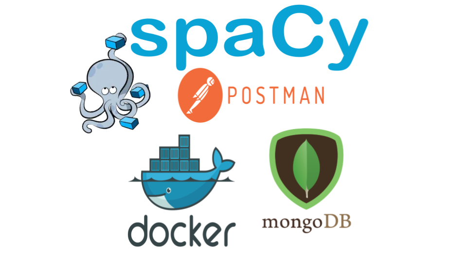

# Plagiarism Detector
This project is aimed to focus on deployment of machine learning model. It exposes an API for Plagiarism detection by utilizing NLP's famous 
library "Spacy". It uses MongDB as the database to store user's information. Whole application is containerized so that it can run smoothly in all the 
systems regardless of base OS.
This api supports three operations
- register/ 
    - It is used for registering a user.
- detect/
    - It detects the similarity of two texts
- refill/
    - It is used for refilling the tokens if exhausted. By default every user is granted 5 tokens initially.

## Tools used:
<p align="center">
  
</p>

## Installation:
- Step 1: Clone the repository using your terminal.
```
git clone https://github.com/THEMrinaal/Plagiarism_Detector.git
```
- Step 2: Navigate inside the root folder "Plagiarism_Detector"
- Step 3: Make your you have docker and docker compose installed.
- Step 4: Build the project by
```
sudo docker-compose build
```
- Step 5: Run the project by
```
sudo docker-compose up
```
- Step 6: Navigate to your postman application to send POST request to the endpoints 

## Type of endpoints:
- To register the user
```
 http://0.0.0.0:5000/register
```
- To detect similarity or plagiarism
```
 http://0.0.0.0:5000/detect
```
- To refill tokens
```
 http://0.0.0.0:5000/refill
```
## Sample POST requests for endpoints:
- register/
```
{
    "username": "<YOUR USERNAME HERE>",
    "password": "<YOUR PASSWORD HERE>"
}
```
- detect/
```
{
    "username": "<SAME USERNAME AS BEFORE>",
    "password": "<SAME PASSWORD AS BEFORE>",
    "text1": "<YOUR FIRST TEXT HERE>",
    "text2": "<YOUR SECOND TEXT HERE>"
}
```
- refill/
```
{
    username: "<SAME USERNAME>",
    admin_pw: "1234",
    refill: 5
}
```